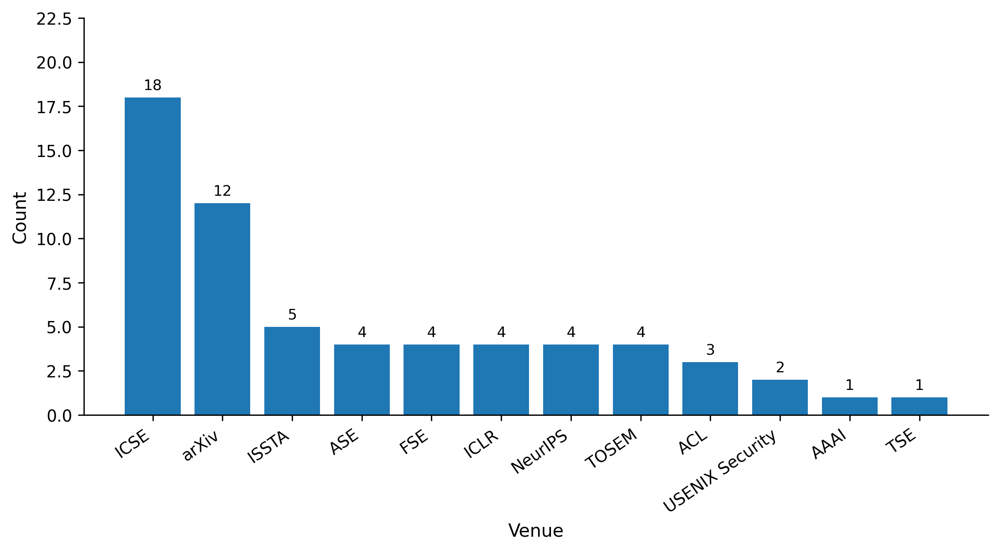

# A Survey of LLM-based Automated Program Repair: Taxonomies, Design Paradigms, and Applications

[](https://arxiv.org/abs/2506.23749)
[](https://arxiv.org/pdf/2506.23749.pdf)
[](LICENSE)
[](https://arxiv.org/abs/2506.23749)

This repository contains a curated collection of 62 representative papers on LLM-based Automated Program Repair (APR), organized by sub-paradigm. The papers span from January 2022 to October 2025.

## 📄 Citation

If you find this taxonomy useful for your research, please consider citing our survey paper:

```bibtex
@article{yang2025survey,
  title={A Survey of LLM-based Automated Program Repair: Taxonomies, Design Paradigms, and Applications},
  author={Yang, Boyang and Cai, Zijian and Liu, Fengling and Le, Bach and Zhang, Lingming and Bissyandé, Tegawendé F. and Liu, Yang and Tian, Haoye},
  journal={arXiv preprint arXiv:2506.23749},
  year={2025},
  url={https://arxiv.org/abs/2506.23749}
}
```

**Paper Link:** [https://arxiv.org/abs/2506.23749](https://arxiv.org/abs/2506.23749)

## Overview

LLM-based APR systems can be categorized into four major paradigms based on their **Training** objective, whether generation is **Single** or **Multiple**, who **Controls** the next step of the workflow:

- **Fine-Tuning**: Systems that adapt pre-trained models through additional training
- **Prompting**: Systems that leverage LLMs without further training
- **Procedural**: Systems with scripted, multi-step workflows controlled by humans
- **Agentic**: Systems where LLMs make autonomous decisions about workflow control



---

## Fine-Tuning Approaches

Fine-tuning approaches adapt pre-trained language models specifically for program repair tasks through additional training.

### Full Fine-Tuning (Full FT)

Complete model parameter updates during training.

| Paper | Year | Venue | PDF |
|-------|------|-------|-----|
| An Empirical Study on Fine-Tuning Large Language Models of Code for Automated Program Repair | 2023 | ASE | [PDF](Fine-Tuning%20Approaches/Supervised%20fine-tuning%20of%20Full%20Models/An_Empirical_Study_on_Fine-Tuning_Large_Language_Models_of_Code_for_Automated_Program_Repair.pdf) |
| Impact of Code Language Models on Automated Program Repair | 2023 | ICSE | [PDF](Fine-Tuning%20Approaches/Supervised%20fine-tuning%20of%20Full%20Models/Impact%20of%20Code%20Language%20Models%20on%20Automated.pdf) |
| Out of Sight, Out of Mind: Better Automatic Vulnerability Repair by Broadening Input Ranges and Sources (VulMaster) | 2024 | ICSE | [PDF](Fine-Tuning%20Approaches/Supervised%20fine-tuning%20of%20Full%20Models/Out%20of%20sight%2C%20out%20of%20mind%20Better%20automatic%20%20vulnerability%20repair%20by%20broadening%20input%20ranges%20and%20sources..pdf) |
| RepairCAT: Applying Large Language Model to Fix Bugs in AI-Generated Programs | 2024 | ICSE Workshop | [PDF](Fine-Tuning%20Approaches/Supervised%20fine-tuning%20of%20Full%20Models/RepairCAT%20Applying%20Large%20Language%20Model%20to%20Fix%20Bugs%20in%20AI-Generated%20Programs..pdf) |

### Parameter-Efficient Fine-Tuning (PEFT)

Efficient adaptation techniques that update only a subset of model parameters.

| Paper | Year | Venue | PDF |
|-------|------|-------|-----|
| Exploring Parameter-Efficient Fine-Tuning of Large Language Model on Automated Program Repair | 2024 | ASE | [PDF](Fine-Tuning%20Approaches/Parameter-Efficient%20Fine-Tuning/Exploring%20Parameter-Efficient%20Fine-Tuning%20of%20Large%20Language.pdf) |
| RepairLLaMA: Efficient Representations and Fine-Tuned Adapters for Program Repair | 2025 | TSE | [PDF](Fine-Tuning%20Approaches/Parameter-Efficient%20Fine-Tuning/Repairllama%20Efficient%20representations%20and%20fine-tuned%20adapters%20%20for%20program%20repair..pdf) |
| MORepair: Teaching LLMs to Repair Code via Multi-Objective Fine-Tuning | 2025 | TOSEM | [PDF](Fine-Tuning%20Approaches/Parameter-Efficient%20Fine-Tuning/MORepair%20Teaching%20LLMs%20to%20Repair%20Code%20via%20Multi-Objective%20Fine-tuning.pdf) |
| When Fine-Tuning LLMs Meets Data Privacy: An Empirical Study of Federated Learning in LLM-Based Program Repair | 2025 | TOSEM | [PDF](Fine-Tuning%20Approaches/Parameter-Efficient%20Fine-Tuning/When%20Fine-Tuning%20LLMs%20Meets%20Data%20Privacy%20An%20Empirical%20Study%20of%20Federated%20Learning%20in%20%20LLM-Based%20Program%20Repair..pdf) |
| The Art of Repair: Optimizing Iterative Program Repair with Instruction-Tuned Models | 2025 | arXiv | [PDF](Fine-Tuning%20Approaches/Parameter-Efficient%20Fine-Tuning/The%20Art%20of%20Repair%20Optimizing%20Iterative%20Program%20Repair%20with%20Instruction-Tuned%20Models.pdf) |

### Knowledge Distillation

Transfer knowledge from larger models to smaller ones for repair tasks.

| Paper | Year | Venue | PDF |
|-------|------|-------|-----|
| KNOD: Domain Knowledge Distilled Tree Decoder for Automated Program Repair | 2023 | ICSE | [PDF](Fine-Tuning%20Approaches/Knowledge%20Distilling/KNOD_Domain_Knowledge_Distilled_Tree_Decoder_for_Automated_Program_Repair.pdf) |
| DistiLRR: Transferring Code Repair for Low-Resource Programming Languages | 2024 | arXiv | [PDF](Fine-Tuning%20Approaches/Knowledge%20Distilling/DistiLRR%20Transferring%20Code%20Repair%20%20for%20Low-Resource%20Programming%20Languages..pdf) |
| NARRepair: Non-Autoregressive Code Generation Model for Automatic Program Repair | 2024 | arXiv | [PDF](Fine-Tuning%20Approaches/Knowledge%20Distilling/Narrepair%20Non-autoregressive%20code%20generation%20model%20for%20%20automatic%20program%20repair.pdf) |

### Reinforcement Learning Fine-Tuning (RLFT)

Apply reinforcement learning techniques to optimize repair models.

| Paper | Year | Venue | PDF |
|-------|------|-------|-----|
| RePair: Automated Program Repair with Process-based Feedback | 2024 | ACL | [PDF](Fine-Tuning%20Approaches/Reinforcement%20Learning%20Fine-Tuning/Repair%20%20Automated%20program%20repair%20with%20process-based%20feedback.pdf) |
| LLM-Powered Code Vulnerability Repair with Reinforcement Learning and Semantic Reward (SecRepair) | 2024 | arXiv | [PDF](Fine-Tuning%20Approaches/Reinforcement%20Learning%20Fine-Tuning/LLM-Powered%20Code%20Vulnerability%20Repair.pdf) |
| SWE-RL: Advancing LLM Reasoning via Reinforcement Learning on Open Software Evolution | 2025 | arXiv | [PDF](Fine-Tuning%20Approaches/Reinforcement%20Learning%20Fine-Tuning/Swe-rl%20Advancing%20llm%20reasoning%20via%20reinforcement%20learning%20on%20open%20software%20%20evolution..pdf) |
| Less is More: Adaptive Program Repair with Bug Localization and Preference Learning (AdaPatcher) | 2025 | AAAI | [PDF](Fine-Tuning%20Approaches/Reinforcement%20Learning%20Fine-Tuning/Less%20is%20More%20Adaptive%20Program%20Repair%20with%20Bug%20Localization%20and%20Preference%20Learning.pdf) |
| Smart-LLaMA-DPO: Reinforced Large Language Model for Explainable Smart Contract Vulnerability Detection | 2025 | ISSTA | [PDF](Fine-Tuning%20Approaches/Reinforcement%20Learning%20Fine-Tuning/Smart-LLaMA-DPO%20Reinforced%20Large%20Language%20Model%20for%20Explainable%20Smart%20Contract%20%20Vulnerability%20Detection..pdf) |

### Context-Enriched Fine-Tuning

Incorporate additional context (execution traces, type information, etc.) during training.

| Paper | Year | Venue | PDF |
|-------|------|-------|-----|
| TraceFixer: Execution Trace-Driven Program Repair | 2023 | arXiv | [PDF](Fine-Tuning%20Approaches/Context-Enriched%20fine-tuning/TraceFixer%20Execution%20tracedriven%20program%20repair..pdf) |
| InferFix: End-to-End Program Repair with LLMs | 2023 | FSE | [PDF](Fine-Tuning%20Approaches/Context-Enriched%20fine-tuning/Inferfix%20End-to-end%20program%20repair%20with%20llms.pdf) |
| PyTy: Repairing Static Type Errors in Python | 2024 | ICSE | [PDF](Fine-Tuning%20Approaches/Context-Enriched%20fine-tuning/Pyty%20Repairing%20static%20type%20errors%20in%20python..pdf) |
| Template-Guided Program Repair in the Era of Large Language Models (NTR) | 2024 | ICSE | [PDF](Fine-Tuning%20Approaches/Context-Enriched%20fine-tuning/Template-guided%20program%20repair%20in%20the%20era%20of%20large%20%20language%20models..pdf) |

---

## Prompting Approaches

Prompting approaches leverage pre-trained LLMs without further training, using carefully designed prompts.

### Zero-Shot Prompting

Direct prompting without examples.

| Paper | Year | Venue | PDF |
|-------|------|-------|-----|
| Less Training, More Repairing Please: Revisiting Automated Program Repair via Zero-Shot Learning (AlphaRepair) | 2022 | FSE | [PDF](Prompting%20Approaches/Zero-shot%20Prompting/Less%20training%2C%20more%20repairing%20please%20revisiting%20automated%20program%20repair%20via%20zero-shot%20learning.pdf) |
| Can OpenAI's Codex Fix Bugs? An Evaluation on QuixBugs | 2022 | ICSE Workshop | [PDF](Prompting%20Approaches/Zero-shot%20Prompting/Can%20OpenAI%27s%20Codex%20Fix%20Bugs.pdf) |
| Automated Repair of Programs from Large Language Models | 2023 | ICSE | [PDF](Prompting%20Approaches/Zero-shot%20Prompting/Automated%20repair%20of%20programs%20%20from%20large%20language%20models.pdf) |
| Is ChatGPT the Ultimate Programming Assistant—How Far Is It? | 2023 | arXiv | [PDF](Prompting%20Approaches/Zero-shot%20Prompting/Is%20ChatGPT%20the%20ultimate%20programming%20assistant%E2%80%93how%20far%20is%20it.pdf) |

### Few-Shot Prompting

Prompting with a small number of examples.

| Paper | Year | Venue | PDF |
|-------|------|-------|-----|
| Automated Program Repair in the Era of Large Pre-Trained Language Models | 2023 | ICSE | [PDF](Prompting%20Approaches/Few-shot%20Prompting/Automated_Program_Repair_in_the_Era_of_Large_Pre-trained_Language_Models.pdf) |
| What Makes Good In-Context Demonstrations for Code Intelligence Tasks with LLMs? | 2023 | ASE | [PDF](Prompting%20Approaches/Few-shot%20Prompting/What_Makes_Good_In-Context_Demonstrations_for_Code_Intelligence_Tasks_with_LLMs.pdf) |
| Majority Rule: Better Patching via Self-Consistency | 2023 | arXiv | [PDF](Prompting%20Approaches/Few-shot%20Prompting/Majority%20Rule%20better%20patching%20via%20Self-Consistency.pdf) |
| Retrieval-Based Prompt Selection for Code-Related Few-Shot Learning (CEDAR) | 2023 | ICSE | [PDF](Prompting%20Approaches/Few-shot%20Prompting/Retrieval-Based_Prompt_Selection_for_Code-Related_Few-Shot_Learning.pdf) |

### Retrieval-Augmented Generation (RAG) Enhanced

Augment prompts with retrieved relevant information.

| Paper | Year | Venue | PDF |
|-------|------|-------|-----|
| Hierarchical Knowledge Injection for Improving LLM-based Program Repair | 2025 | arXiv | [PDF](Prompting%20Approaches/Retrieval-Augmented%20Generation%20Enhanced%20Prompting/Hierarchical%20Knowledge%20Injection%20for%20Improving%20LLM-based%20Program%20Repair.pdf) |
| When Large Language Models Confront Repository-Level Automatic Program Repair: How Well They Done? (RLCE) | 2024 | ICSE Companion | [PDF](Prompting%20Approaches/Retrieval-Augmented%20Generation%20Enhanced%20Prompting/When%20%20large%20language%20models%20confront%20repository-level%20automatic%20program%20repair%20How%20well%20they%20done.pdf) |
| Knowledge-Enhanced Program Repair for Data Science Code (DSrepair) | 2025 | ICSE | [PDF](Prompting%20Approaches/Retrieval-Augmented%20Generation%20Enhanced%20Prompting/Knowledge-Enhanced%20Program%20Repair%20for%20%20Data%20Science.pdf) |

### Analysis-Augmented Generation (AAG) Enhanced

Augment prompts with program analysis results.

| Paper | Year | Venue | PDF |
|-------|------|-------|-----|
| APPATCH: Automated Adaptive Prompting Large Language Models for Real-World Software Vulnerability Patching | 2025 | USENIX Security | [PDF](Prompting%20Approaches/Analysis-Augmented%20Generation%20Enhanced%20Prompting/APPATCH%20Automated%20Adaptive%20Prompting%20Large%20Language%20Models%20for%20Real-World%20Software%20Vulnerability%20Patching.pdf) |
| Aligning the Objective of LLM-Based Program Repair (D4C) | 2025 | ICSE | [PDF](Prompting%20Approaches/Analysis-Augmented%20Generation%20Enhanced%20Prompting/Aligning%20the%20Objective%20of%20LLM-based%20Program%20Repair..pdf) |
| Towards Effectively Leveraging Execution Traces for Program Repair with Code LLMs (TracePrompt) | 2025 | ACL Workshop | [PDF](Prompting%20Approaches/Analysis-Augmented%20Generation%20Enhanced%20Prompting/Towards%20Effectively%20Leveraging%20%20Execution%20Traces%20for%20Program%20Repair%20with%20Code%20LLMs..pdf) |

---

## Procedural Approaches

Procedural approaches follow scripted, multi-step workflows for program repair.

### Test-in-the-Loop

Iterative repair guided by test execution feedback.

| Paper | Year | Venue | PDF |
|-------|------|-------|-----|
| Automated Program Repair via Conversation: Fixing 162 out of 337 Bugs for $0.42 Each Using ChatGPT (ChatRepair) | 2024 | ISSTA | [PDF](Procedural%20Approaches/Test-in-the-Loop%20Pipelines/Automated%20program%20repair%20via%20conversation%20Fixing%20162%20out%20of%20337%20%20bugs%20for%20%240.42%20each%20using%20ChatGPT.pdf) |
| ThinkRepair: Self-Directed Automated Program Repair | 2024 | ISSTA | [PDF](Procedural%20Approaches/Test-in-the-Loop%20Pipelines/Thinkrepair%20Self-directed%20%20automated%20program%20repair..pdf) |
| Code Repair with LLMs Gives an Exploration-Exploitation Tradeoff (REx) | 2024 | NeurIPS | [PDF](Procedural%20Approaches/Test-in-the-Loop%20Pipelines/Code%20repair%20%20with%20llms%20gives%20an%20exploration-exploitation%20tradeoff.pdf) |
| ContrastRepair: Enhancing Conversation-Based Automated Program Repair via Contrastive Test Case Pairs | 2025 | TOSEM | [PDF](Procedural%20Approaches/Test-in-the-Loop%20Pipelines/Contrastrepair%20Enhancing%20%20conversation-based%20automated%20program%20repair%20via%20contrastive%20test%20case%20pairs.pdf) |

### Human-in-the-Loop

Interactive repair with human guidance.

| Paper | Year | Venue | PDF |
|-------|------|-------|-----|
| CREF: An LLM-Based Conversational Software Repair Framework for Programming Tutors | 2024 | ISSTA | [PDF](Procedural%20Approaches/Human-in-the-Loop%20Pipelines/Cref%20An%20llm-based%20conversational%20software%20repair%20framework%20for%20programming%20tutors..pdf) |
| Human-in-the-Loop Software Development Agents (HULA) | 2025 | ICSE-SEIP | [PDF](Procedural%20Approaches/Human-in-the-Loop%20Pipelines/Human-In-the-Loop%20Software%20Development%20Agents..pdf) |
| Enhancing LLM-Based Automated Program Repair with Design Rationales (DRCodePilot) | 2024 | arXiv | [PDF](Procedural%20Approaches/Human-in-the-Loop%20Pipelines/Enhancing%20LLM-Based%20Automated%20Program%20%20Repair%20with%20Design%20Rationales..pdf) |

### RAG-in-the-Loop

Multi-step workflows incorporating retrieval mechanisms.

| Paper | Year | Venue | PDF |
|-------|------|-------|-----|
| Demystifying LLM-Based Software Engineering Agents (Agentless) | 2025 | FSE | [PDF](Procedural%20Approaches/RAG-in-the-Loop%20Pipelines/Agentless%20Demystifying%20llm-based%20%20software%20engineering%20agents..pdf) |
| PATCH: Empowering Large Language Model with Programmer-Intent Guidance and Collaborative-Behavior Simulation for Automatic Bug Fixing | 2025 | TOSEM | [PDF](Procedural%20Approaches/RAG-in-the-Loop%20Pipelines/PATCH%20Empowering%20Large%20Language%20Model%20with%20Programmer-Intent%20Guidance%20and%20Collaborative-Behavior%20Simulation%20for%20Automatic%20Bug%20Fixing.pdf) |
| Enhancing Repository-Level Software Repair via Repository-Aware Knowledge Graphs (KGCompass) | 2025 | arXiv | [PDF](Procedural%20Approaches/RAG-in-the-Loop%20Pipelines/Enhancing%20Repository-Level%20%20Software%20Repair%20via%20Repository-Aware%20Knowledge%20Graphs.pdf) |

### AAG-in-the-Loop

Multi-step workflows incorporating program analysis.

| Paper | Year | Venue | PDF |
|-------|------|-------|-----|
| Copiloting the Copilots: Fusing Large Language Models with Completion Engines for Automated Program Repair (Repilot) | 2023 | FSE | [PDF](Procedural%20Approaches/AAG-in-the-Loop%20Pipelines/Copiloting%20the%20Copilots%20Fusing%20Large%20Language%20Models%20with%20Completion%20Engines%20for%20Automated%20Program%20Repair.pdf) |
| Logs In, Patches Out: Automated Vulnerability Repair via Tree-of-Thought LLM Analysis (SAN2PATCH) | 2025 | USENIX Security | [PDF](Procedural%20Approaches/AAG-in-the-Loop%20Pipelines/Logs%20In%2C%20Patches%20Out%20Automated%20Vulnerability%20Repair%20via%20Tree-of-Thought%20LLM%20Analysis.pdf) |
| PredicateFix: Repairing Static Analysis Alerts with Bridging Predicates | 2025 | arXiv | [PDF](Procedural%20Approaches/AAG-in-the-Loop%20Pipelines/PredicateFix%20%20Repairing%20Static%20Analysis%20Alerts%20with%20Bridging%20Predicates.pdf) |
| LLM4CVE: Enabling Iterative Automated Vulnerability Repair with Large Language Models | 2025 | arXiv | [PDF](Procedural%20Approaches/AAG-in-the-Loop%20Pipelines/LLM4CVE%20Enabling%20Iterative%20Automated%20Vulnerability%20Repair%20with%20Large%20Language%20%20Models..pdf) |

---

## Agentic Approaches

Agentic approaches give LLMs autonomous decision-making capabilities in the repair workflow.

### Tool-Augmented Agents

LLM agents that can use external tools to assist repair.

| Paper | Year | Venue | PDF |
|-------|------|-------|-----|
| SWE-Agent: Agent-Computer Interfaces Enable Automated Software Engineering | 2024 | NeurIPS | [PDF](Agentic%20Approaches/Tool-Augmented%20Agents/Swe-agent%20Agent-computer%20interfaces%20enable%20automated%20software%20engineering..pdf) |
| AutoCodeRover: Autonomous Program Improvement | 2024 | ISSTA | [PDF](Agentic%20Approaches/Tool-Augmented%20Agents/Autocoderover%20Autonomous%20program%20%20improvement..pdf) |
| RepairAgent: An Autonomous, LLM-Based Agent for Program Repair | 2025 | ICSE | [PDF](Agentic%20Approaches/Tool-Augmented%20Agents/Repairagent%20An%20autonomous%2C%20llm-based%20agent%20for%20%20program%20repair..pdf) |
| Unlocking LLM Repair Capabilities in Low-Resource Programming Languages Through Cross-Language Translation and Multi-Agent Refinement (LANTERN) | 2025 | arXiv | [PDF](Agentic%20Approaches/Tool-Augmented%20Agents/Unlocking%20LLM%20Repair%20Capabilities%20in%20Low-Resource%20Programming%20Languages%20Through%20Cross-Language%20Translation%20%20and%20Multi-Agent%20Refinement..pdf) |
| Agent That Debugs: Dynamic State-Guided Vulnerability Repair (VulDebugger) | 2025 | arXiv | [PDF](Agentic%20Approaches/Tool-Augmented%20Agents/Agent%20That%20Debugs%20Dynamic%20State-Guided%20Vulnerability%20Repair..pdf) |
| SWE-bench Multimodal: Do AI Systems Generalize to Visual Software Domains? (SWE-Agent M) | 2025 | ICLR | [PDF](Agentic%20Approaches/Tool-Augmented%20Agents/SWE-bench%20Multimodal%20Do%20AI%20Systems%20Generalize%20to%20Visual%20%20Software%20Domains.pdf) |
| OpenHands: An Open Platform for AI Software Developers as Generalist Agents | 2025 | ICLR | [PDF](Agentic%20Approaches/Tool-Augmented%20Agents/Openhands%20An%20open%20platform%20for%20ai%20software%20developers%20as%20generalist%20agents..pdf) |

### LLM-as-Judges

LLMs evaluate and select among candidate patches.

| Paper | Year | Venue | PDF |
|-------|------|-------|-----|
| CleanVul: Automatic Function-Level Vulnerability Detection in Code Commits Using LLM Heuristics (VulSifter) | 2024 | arXiv | [PDF](Agentic%20Approaches/LLM-as-Judges/CleanVul%20Automatic%20Function-Level%20Vulnerability%20Detection%20in%20Code%20%20Commits%20Using%20LLM%20Heuristics.pdf) |
| Leveraging Large Language Model for Automatic Patch Correctness Assessment (LLM4PatchCorrect) | 2024 | TSE | [PDF](Agentic%20Approaches/LLM-as-Judges/Leveraging_Large_Language_Model_for_Automatic_Patch_Correctness_Assessment.pdf) |
| Large Language Model Critics for Execution-Free Evaluation of Code Changes (Execution-free Critic) | 2025 | arXiv | [PDF](Agentic%20Approaches/LLM-as-Judges/Large%20Language%20Model%20Critics%20for%20%20Execution-Free%20Evaluation%20of%20Code%20Changes.pdf) |

### Self-Controlled System

LLM-driven systems that autonomously plan and control repair workflows.

| Paper | Year | Venue | PDF |
|-------|------|-------|-----|
| MAGIS: LLM-Based Multi-Agent Framework for GitHub Issue Resolution | 2024 | NeurIPS | [PDF](Agentic%20Approaches/Self-Controlled%20System/Magis-llm-based-multi-agent-framework-for-github-issue-resolution.pdf) |
| SWE-Search: Enhancing Software Agents with Monte Carlo Tree Search and Iterative Refinement | 2025 | ICLR | [PDF](Agentic%20Approaches/Self-Controlled%20System/SWE-Search%20Enhancing%20Software%20Agents%20with%20Monte%20Carlo%20Tree%20Search%20and%20Iterative%20Refinement.pdf) |
| Learn-by-Interact: A Data-Centric Framework For Self-Adaptive Agents in Realistic Environments | 2025 | ICLR | [PDF](Agentic%20Approaches/Self-Controlled%20System/Learn-by-Interact%20A%20Data-Centric%20Framework%20For%20Self-Adaptive%20Agents%20in%20Realistic%20Environments.pdf) |
